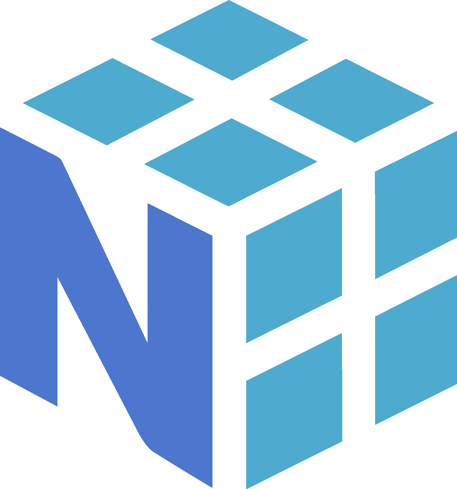
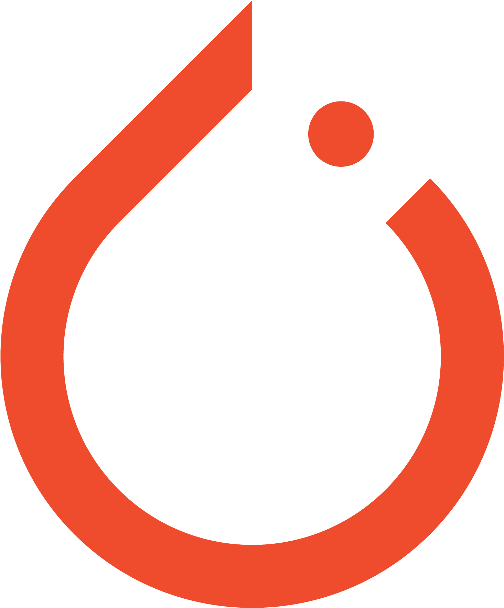
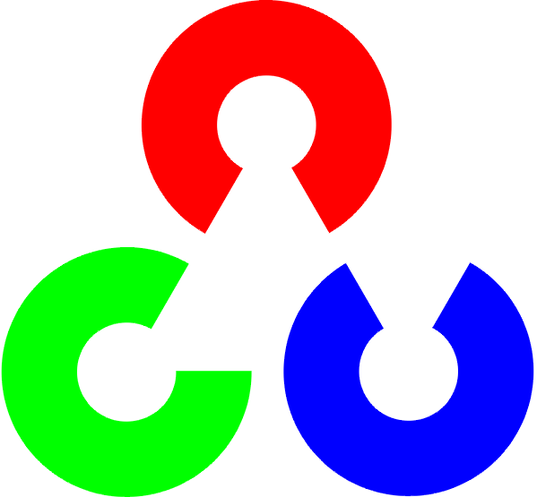
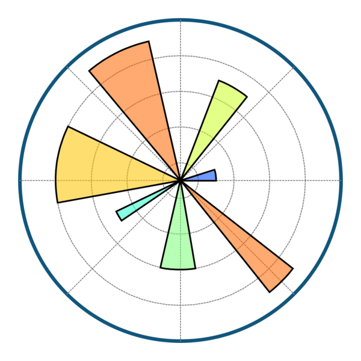
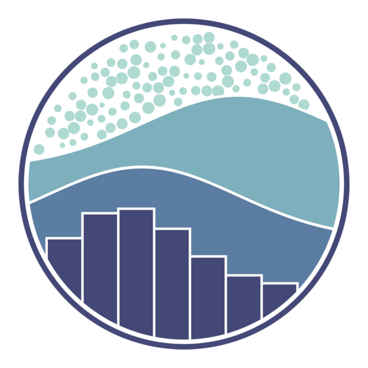
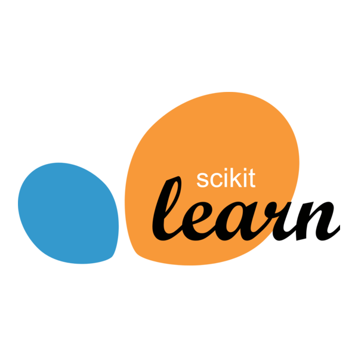
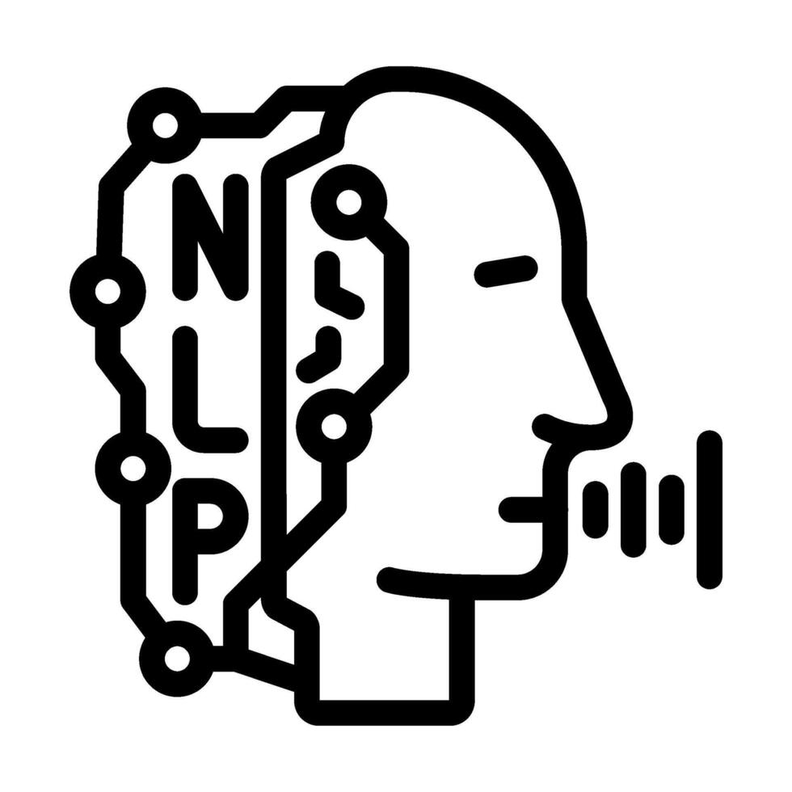

  

# 👋 Hi, I'm Prince Thakur

🚀 **Software Engineer | Full-Stack Developer | DSA & AI Enthusiast**      
🎓 B.E. Computer Engineering @ SPPU | CGPA: **8.31**

I’m passionate about building **real-world software**, solving **DSA problems**, and exploring **AI/ML & system-level concepts**.  
Currently focused on writing **clean, efficient code** and contributing to **impactful projects & open source**.

---

## 🧑‍💻 About Me
- 🔭 Working on **Full-Stack & AI-based projects**
- 🌱 Strengthening **DSA, System Design & Backend APIs**
- 💡 Interested in **Software Engineering, Data Science & AI**
- 🏆 7⭐+ badges on HackerRank
- 🎯 Actively seeking **SDE / Software Engineer opportunities**

---

# 🛠️ Tech Stack

<b>💻 Programming Languages</b>

 

<table>
<tr align="center">
<td>
 <b>Python</b>
</td>
<td>
 <b>Java</b>
</td>
<td>
 <b>C</b>
</td>
<td>
 <b>C++</b>
</td>
<td>
 <b>PHP</b>
</td>
<td>
 <b>TypeScript</b>
</td>
<td>
 <b>Kotlin</b>
</td>
</tr>
</table>

<b>🌐 Frontend Development</b>

 

<table>
<tr align="center">
<td> <b>HTML5</b></td>
<td> <b>CSS3</b></td>
<td> <b>JavaScript</b></td>
<td> <b>Bootstrap</b></td>
<td> <b>jQuery</b></td>
<td> <b>React</b></td>
</tr>
</table>

<b>⚙️ Backend & Frameworks</b>

 

<table>
<tr align="center">
<td> <b>Django</b></td>
<td> <b>FastAPI</b></td>
<td> <b>Laravel</b></td>
<td> <b>Node.js</b></td>
<td>🌐 <b>REST API</b></td>
</tr>
</table>

<b>🤖 AI / ML / Data Science</b>

 

<table>
<tr align="center">
<td> <b>NumPy</b></td>
<td> <b>Pandas</b></td>
<td> <b>PyTorch</b></td>
<td> <b>OpenCV</b></td>
<td> <b>Matplotlib</b></td>
<td> <b>Seaborn</b></td>
<td> <b>Scikit-Learn</b></td>
<td> <b>NLP</b></td>
</tr>
</table>

<b>🗄️ Databases</b>

 

<table>
<tr align="center">
<td> <b>MySQL</b></td>
<td> <b>MongoDB</b></td>
<td>🗃️ <b>SQL</b></td>
</tr>
</table>

<b>🔁 Version Control</b>

 

<table>
<tr align="center">
<td> <b>Git</b></td>
<td> <b>GitHub</b></td>
</tr>
</table>

<b>🧰 Tools & IDEs</b>

 

<table>
<tr align="center">
<td> <b>VS Code</b></td>
<td> <b>Postman</b></td>
<td> <b>Git</b></td>
<td> <b>Jupyter</b></td>
</tr>
</table>

<b>🧠 Core Computer Science</b>

 

- 📘 Data Structures & Algorithms
- 🧩 Problem Solving
- 💻 Operating Systems
- 🗄️ DBMS
- 🌐 Computer Networks
- 🏛️ Computer Organization & Architecture
- ⚙️ Compiler Design
- 📐 Theory of Computation

  

